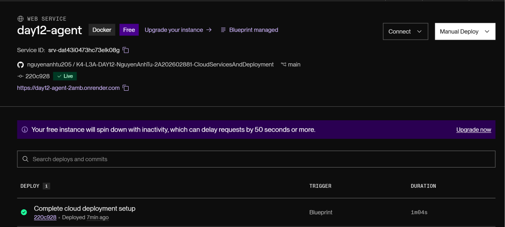
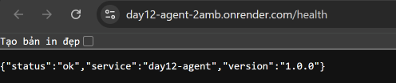
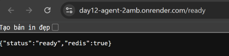
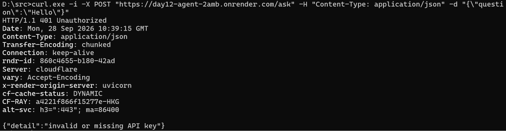

# Thông Tin Deploy — Checkpoint 5

## Thông Tin Học Viên

| Mục | Nội dung |
|---|---|
| Họ và tên | Nguyễn Anh Tú |
| Mã học viên | 2A202602881 |
| Repo | [K4-L3A-DAY12-NguyenAnhTu-2A202602881-CloudServicesAndDeployment](https://github.com/nguyenanhtu205/K4-L3A-DAY12-NguyenAnhTu-2A202602881-CloudServicesAndDeployment) |

## Service

| Mục | Nội dung |
|---|---|
| Public URL | https://day12-agent-2amb.onrender.com |
| Platform | Render (Blueprint) |
| Ngày deploy | 2026-09-28 |

## Biến Môi Trường Đã Set Trên Cloud

Chỉ ghi tên biến và nguồn cấp; không ghi giá trị của secret.

| Biến | Trạng thái | Nguồn / ghi chú |
|---|---|---|
| `PORT` | Render tự cấp | Không cấu hình thủ công |
| `AGENT_API_KEY` | Đã cấu hình | Secret nhập trong Render khi tạo Blueprint |
| `REDIS_URL` | Đã cấu hình | Connection string của Render Key Value `day12-redis` |
| `RATE_LIMIT_PER_MINUTE` | Đã cấu hình | `10`, theo `render.yaml` |
| `MONTHLY_BUDGET_USD` | Đã cấu hình | `10.0`, theo `render.yaml` |
| `LOG_LEVEL` | Đã cấu hình | `INFO`, theo `render.yaml` |

## Kết Quả Kiểm Tra Thực Tế

Các kết quả dưới đây được xác nhận từ output và ảnh chụp ngày 2026-09-28:

| Kiểm tra | Kết quả |
|---|---|
| `GET /health` | HTTP 200 — `{"status":"ok","service":"day12-agent","version":"1.0.0"}` |
| `GET /ready` | HTTP 200 — `{"status":"ready","redis":true}` |
| `POST /ask` không có API key | HTTP 401 — `{"detail":"invalid or missing API key"}` |

Lệnh kiểm tra `/ask` trong Windows Command Prompt:

```cmd
curl.exe -i -X POST "https://day12-agent-2amb.onrender.com/ask" -H "Content-Type: application/json" -d "{\"question\":\"Hello\"}"
```

## Ảnh Chụp Màn Hình

Đặt bốn ảnh minh chứng sau trong `screenshots/`:

### Render dashboard — deploy Live



### `/health` — HTTP 200



### `/ready` — Redis sẵn sàng



### `/ask` không có API key — HTTP 401


